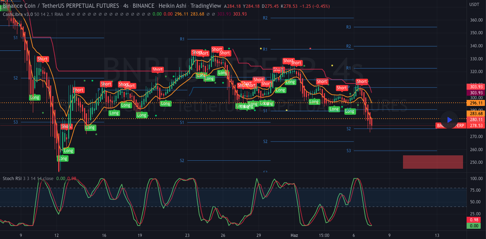

# Cashlibra v3.0

### Nothing written or shared here is investment advice. Cryptocurrency investments involves high risk.

#

Cashlibra is a tradingview indicator that shows long/short signals, pivot points, auto fib. retracements and auto drawn linear regression channel, based on Heikin-ashi candles.

Written in pinescript

## TradingView Configuration

- Set the candles as heikin-ashi
- Add the indicator as favorite on the link below or use the code on this repository
- Add Stoch RSI Indicator to TradingView
- Link on Tradingview: [https://tr.tradingview.com/script/3KvQHE75/]()

## How to use

- First of all, no signals are %100 guaranteed to work
- In case of getting an short/long signal; if a long trade is to be opened, it is appropriate for the Stoch RSI signal to cross above 40 for long trades and below 80 for short trades.
- You can check the buy/sell signals on screenshot below with stoch rsi. As you can see, we have to eliminate some signals and increase our chances because they do not meet the rsi conditions.
- All of these lines on indicator which are drawn by dots are the pivots, the price is expected to react from these levels.
- All of these lines on indicator which are pointed like S1/R1 etc. are fibonacci levels and the price is expected to react from these levels.

  

### Todo list

- [x] Pivot lines
- [x] Long/Short signal labels
- [x] Auto linear regression channel
- [x] Auto draw fibonacci lines
- [x] Calculate real ha-candle color
- [ ] Add missing translations for english
- [ ] Add Backtests
- [ ] Add an toggle option for all of things above

### Buy me a Coffee

- TRC20 USDT Address: TQ9GM2V2cHrQGZiCpSxuJ6FVGUtWfJ29Y4
